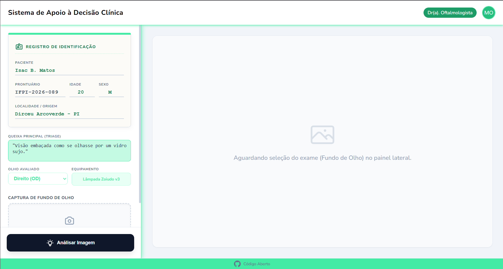
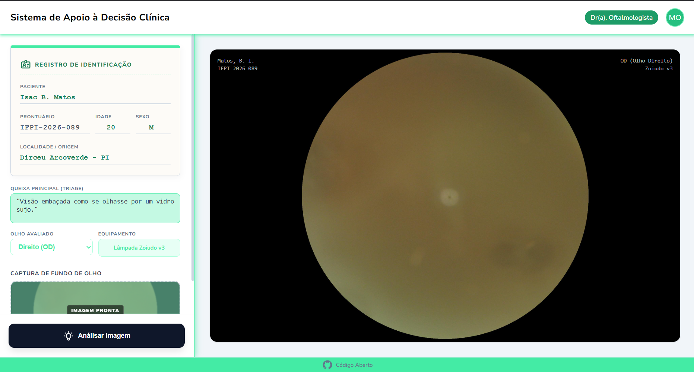
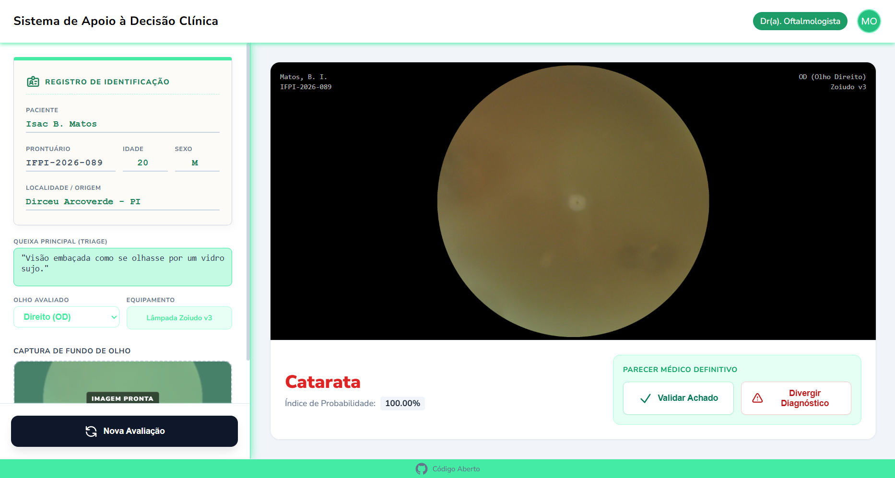

# Trabalho de Tópicos Especiais em Computação

## |📖 Documentação Completa

- [1. Definição do Problema](docs/01-definicao-do-problema.md)
- [2. Objetivo da Solução](docs/02-objetivo-da-solucao.md)
- [3. Base de Dados](docs/03-base-de-dados.md)
- [4. Modelagem em Deep Learning](docs/04-modelagem-deep-learning.md)
- [5. Avaliação dos Resultados](docs/05-avaliacao-dos-resultados.md)
- [6. Aplicabilidade Real](docs/06-aplicabilidade-real.md)

## Sistema de Apoio à Decisão Clínica
O SADC é uma API desenvolvida em Django que integra um modelo de Deep Learning para auxiliar médicos oftalmologistas no diagnóstico preliminar de catarata através da análise de imagens de fundo de olho.

O sistema conta com um front-end nativo em formato de Prontuário Eletrônico, permitindo uma interface de validação médica intuitiva, e um back-end robusto focado em pré-processamento avançado de imagens médicas.

## | Interface do Sistema

### 1. Registro e Captura do Exame

O médico visualiza as informações do paciente e realiza a seleção da imagem de fundo de olho para análise.



### 2. Visualização do Exame

Após a captura, a imagem é carregada para inspeção visual antes do processamento pelo modelo de Deep Learning.



### 3. Resultado da Análise

O sistema apresenta o diagnóstico sugerido juntamente com o índice de probabilidade calculado pelo modelo, permitindo a validação ou divergência pelo especialista.



Link de Acesso: 

## | Tecnologias Utilizadas:

### Back-end & API;

- Python 3.12+
- Django 6.0+ (Servidor HTTP)
- Django REST Framework (Estruturação do endpoint)

### Front-end;

- HTML5
- CSS3
- JavaScript

## | Funcionalidades:

* **Interface de Prontuário Digital:** Visualização da ficha do paciente integrada ao uploader de exames.
* **Pré-processamento Dinâmico:** Conversão, redimensionamento (224x224) e reescala de pixels (-1 a 1) idênticos ao pipeline nativo do MobileNetV2.
* **Análise em Tempo Real:** Retorno assíncrono do diagnóstico sugerido e do índice de probabilidade do modelo.
* **Validação Médica:** Botões de ação para o especialista aprovar ou divergir do laudo algorítmico.

## | Estrutura do Projeto:

A estrutura de diretórios abaixo reflete a arquitetura modular adotada no sistema, separando claramente as lógicas de roteamento web, a interface de usuário (Prontuário Eletrônico) e o isolamento dos modelos de Inteligência Artificial.

```
├── 📁 ODIR-5K - Copia
├── 📁 api
│   ├── 📁 static
│   │   └── 📁 api
│   │       ├── 📁 css
│   │       │   └── 🎨 style.css
│   │       └── 📁 js
│   │           └── 📄 main.js
│   ├── 📁 templates
│   │   └── 📁 api
│   │       └── 🌐 painel.html
│   ├── 🐍 __init__.py
│   ├── 🐍 admin.py
│   ├── 🐍 apps.py
│   ├── 🐍 models.py
│   ├── 🐍 tests.py
│   └── 🐍 views.py
├── 📁 docs
│   ├── 📝 01-definicao-do-problema.md
│   ├── 📝 02-objetivo-da-solucao.md
│   ├── 📝 03-base-de-dados.md
│   ├── 📝 04-modelagem-deep-learning.md
│   ├── 📝 05-avaliacao-dos-resultados.md
│   └── 📝 06-aplicabilidade-real.md
├── 📁 imagens
│   ├── 🖼️ analise.png
│   ├── 🖼️ image.png
│   ├── 🖼️ inicio.png
│   └── 🖼️ selecao.png
├── 📁 modelo
├── 📁 server
│   ├── 🐍 __init__.py
│   ├── 🐍 asgi.py
│   ├── 🐍 settings.py
│   ├── 🐍 urls.py
│   └── 🐍 wsgi.py
├── ⚙️ .gitignore
├── 📝 README.MD
├── 📄 db.sqlite3
├── 🐍 manage.py
├── 📄 modelo_catarata_mobilenetv2_final.keras
├── 📄 requirements.txt
├── 📄 runtime.txt
└── 🐍 testar_api.py
```

---
*Generated by FileTree Pro Extension*

### Legenda de Diretórios Principais;
* **`api/`**: Contém o coração da aplicação, incluindo as *views* que interagem com o Keras para processar as imagens e os *templates* HTML limpos.
* **`static/`**: Armazena os arquivos estáticos isolados, garantindo a separação de responsabilidades e um front-end leve, sem dependência de frameworks externos.
* **`models/`**: Diretório dedicado a armazenar os pesos treinados do modelo de rede neural, mantendo o *core* de IA independente da lógica web.
* **`server/`**: Configurações globais do Django, definições de rotas (`urls.py`), mapeamento de arquivos estáticos e regras de segurança.
* **`docs/`**: Diretório dedicado à documentação completa e organizada do projeto. Contém os arquivos Markdown com a descrição detalhada de cada etapa do desenvolvimento.

## | Instruções de Instalação:

Siga o passo a passo abaixo para configurar o ambiente localmente.

1. Clone o repositório

```bash
git https://github.com/IsacBM/trabalho_ia.git
cd trabalho_ia
```

2. Crie e ative um Ambiente Virtual:

```bash
# No Windows:
python -m venv venv
venv\Scripts\activate
```

```bash
# No Linux/Mac:
python3 -m venv venv
source venv/bin/activate
```

3. Instale as dependências

```bash
pip install -r requirements.txt
```

4. Adicione o Modelo de IA:

Certifique-se de que o arquivo de pesos do seu modelo pré-treinado esteja localizado na pasta raiz do projeto, ao lado do arquivo manage.py.

## | Instruções de Execução:

1. Aplique as migrações do banco de dados

```bash
python manage.py migrate
```

2. Inicie o Servidor de Desenvolvimento

```bash
python manage.py runserver
```

3. Acesse a Aplicação
Abra o navegador e acesse a interface visual do CAD em:

```plaintext
http://127.0.0.1:8000/
```
## | Documentação do Endpoint Principal:
A aplicação consome a própria API internamente. Caso o time do modelo precise testar requisições via Postman ou Insomnia, utilize a rota abaixo:

```plaintext
URL: /api/diagnostico/
Método: POST
Body: multipart/form-data
imagem: [Arquivo JPG ou PNG do exame de fundo de olho]
```

Retorno de Sucesso (Exemplo):

```json
{
    "status": "sucesso",
    "diagnostico": "Catarata",
    "confianca": "98.50%"
}
```

## | Time de Contribuidores:
<div align="center">
 
|  [<br><sub>Isac B. Matos</sub>](https://github.com/IsacBM) | [<br><sub>Kassandra Rabêlo</sub>](https://github.com/KassandraMRabelo) | [<br><sub>João Pedro</sub>](https://github.com/iaejotape) | [<br><sub>Priscila Freitas</sub>](https://github.com/FreitasPriscila) | [<br><sub>Diogo Bruno</sub>](https://github.com/DiogoBramorim) | [<br><sub>Maria Eduarda</sub>](https://github.com/) |
| :---: | :---: | :---: | :---: | :---: | :---: |

</div>

<h4 align="center"><strong>#Trabalho de Tópicos Especiais em Computação</strong>💙 <br></h4>
